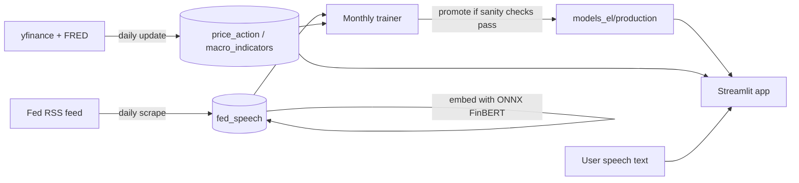
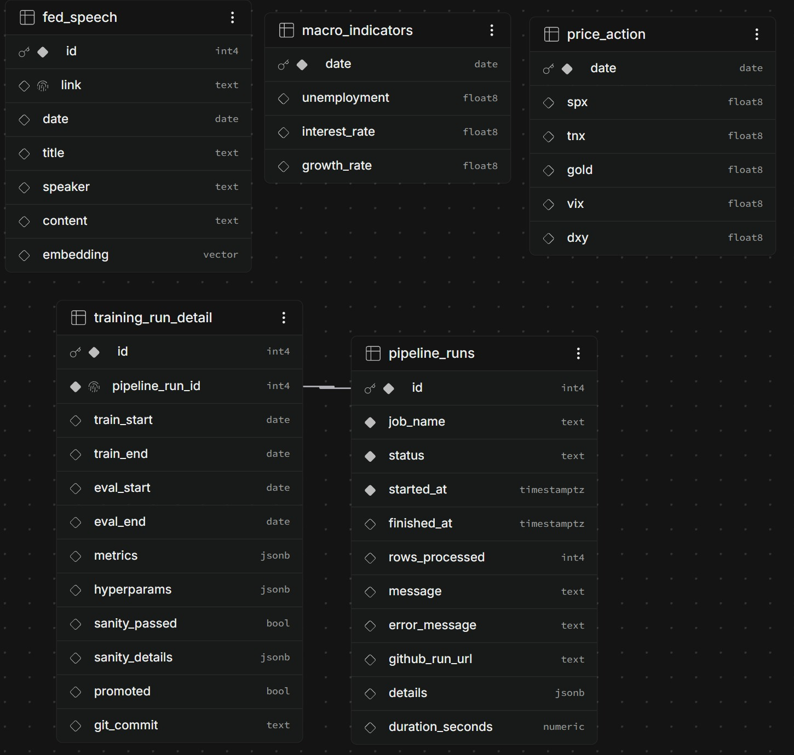

# Speech2Market

**Paste a Federal Reserve speech, get projected moves in equities, gold, volatility, and rates over the next 3, 7, and 30 days.**

Speech2Market embeds the speech text with FinBERT and combines it with price momentum, volatility, and macroeconomic features. A two-stage model (direction classifier + magnitude regressor) then predicts returns for the S&P 500, Gold, VIX, and the 10Y Treasury yield. The whole pipeline keeps itself up to date: it scrapes new speeches, embeds them, refreshes market data, and retrains monthly, all through GitHub Actions and Supabase.

🔗 **Live demo:** `https://fed-speech-app.streamlit.app/`

> ⚠️ Predicted returns come from a model trained on historical speech and market data. This is a research project, **not investment advice**.

---

## Features

- **Live prediction UI** built with Streamlit. Paste a transcript, pick a speech date, and get a t+3 / t+7 / t+30 grid for SPX, GOLD, VIX, and TNX.
- **Market context charts** showing the trailing 3 months of prices and 12 months of macro indicators around the chosen date.
- **Direction and confidence.** Each target returns a signed % move plus the classifier's up-probability.
- **Pipeline Logs page** showing run history for the scraper, embedder, market data updater, and trainer, including training metrics, hyperparameters, sanity checks, and promotion status.
- **Fully automated MLOps loop** covering daily scraping, embedding, and data refresh, plus monthly rolling-window retraining with a sanity gate.
- **Lightweight inference.** FinBERT runs as an FP16 ONNX model on CPU, so there is no PyTorch or `transformers` at runtime.

## How it works



### Model

For each of the 12 targets (`{SPX, GOLD, VIX, TNX} × {t+3, t+7, t+30}`), the app runs two models:

| Stage | Model | Output |
|---|---|---|
| Sign | `HistGradientBoostingClassifier` | P(return > 0), thresholded at a per-target cutoff tuned for macro-F1 |
| Magnitude | `HistGradientBoostingRegressor` | \|return\| |

The final prediction is `sign × magnitude`.

**Features**

- **Speech embedding:** FinBERT `[CLS]` embeddings over overlapping 512-token windows (stride 50), averaged into a single vector per speech.
- **Price features** for SPX, GOLD, TNX, DXY, and VIX: 3/7/30-day momentum, 3/7/30-day mean log return, and 7/30-day volatility. All are lagged by one day to avoid look-ahead.
- **Macro features:** unemployment, Fed funds rate, and GDP growth. Unemployment and GDP growth carry a 30-day publication lag, and everything is forward-filled to a daily calendar.

**Training**

- Monthly rolling-window retrain with fixed per-target hyperparameters from a one-off Optuna search.
- Purged train/eval split with a 30-day gap, so no forward-return labels leak across the boundary. The eval window is the trailing 4 months.
- Speeches are sample-weighted by speaker role (Chair > Vice Chair > Governor > other).
- Sign thresholds are chosen from purged `TimeSeriesSplit` out-of-fold predictions.
- A sanity gate checks prediction variance, magnitude bounds, and AUC inversion before a new model is promoted and committed back to the repo.

## Automation (GitHub Actions)

| Workflow | Schedule | What it does |
|---|---|---|
| `fed_scrape.yml` | Daily, 13:00 UTC | Pulls new speeches and testimony from the Fed RSS feed into `fed_speech` |
| `fed_embed.yml` | After a successful scrape, or manual | Fills in NULL embeddings using ONNX FinBERT |
| `update-data.yml` | Daily, 03:00 UTC | Refreshes `price_action` (yfinance) and `macro_indicators` (FRED) in one atomic transaction after validation |
| `fed_train.yml` | Monthly, 1st at 04:00 UTC | Retrains, evaluates, and commits promoted models to `models_el/production` |
| `keep_alive.yml` | Periodic | Pings the Streamlit app and wakes it if it's sleeping |

Every job writes its status to `pipeline_runs` (and `training_run_detail` for the trainer), which powers the Pipeline Logs page.

## Tech stack

**App:** Streamlit, Plotly, pandas, NumPy
**ML:** scikit-learn (HistGradientBoosting), ONNX Runtime, Hugging Face `tokenizers`, FinBERT (ONNX FP16), joblib
**Data:** Supabase (Postgres + pgvector), yfinance, FRED (`fredapi`), BeautifulSoup
**Infra:** GitHub Actions, Git LFS, Streamlit Community Cloud

## Project structure

```
.
├── app.py                        # Streamlit UI (prediction + market context)
├── predict.py                    # ONNX FinBERT embedding + sign×magnitude inference
├── features.py                   # Inference-time feature engineering (must mirror training)
├── db.py                         # Supabase client + paginated fetch helper
├── pages/
│   └── 1_Pipeline_Logs.py        # Pipeline & training run dashboard
├── scripts/
│   ├── TOOLS_automate_scrape_db.py   # Fed speech scraper
│   ├── TOOLS_automate_embed_db.py    # Incremental embedder
│   ├── update_data_db.py             # Price + macro data updater
│   ├── TOOLS_automate_train_db.py    # Monthly rolling-window trainer
│   ├── pipeline_logging.py           # Shared run-logging helpers
│   ├── ping.py                       # Keep-alive pinger
│   └── requirements-*.txt            # Per-job dependencies
├── models/finbert-onnx/          # FP16 ONNX FinBERT + tokenizer (Git LFS)
├── models_el/production/         # Sign/magnitude models, thresholds, feature columns
├── .github/workflows/            # Automation
└── .streamlit/config.toml        # Dark theme
```

## Run your own copy

The app is already live at `https://fed-speech-app.streamlit.app/`. This section is only for people who want to fork and self-host it, which requires your own Supabase project and the data pipeline below.

<details>
<summary><b>Self-hosting instructions</b></summary>

### Prerequisites

- Python 3.11+
- [Git LFS](https://git-lfs.com/) (the ONNX model is stored with LFS)
- A Supabase project with the pgvector extension enabled

### Install and run

```bash
git clone https://github.com/avalon-py/fed-speech-app.git
cd fed-speech-app
git lfs pull

python -m venv venv
source venv/bin/activate        # Windows: venv\Scripts\activate
pip install -r requirements.txt
```

Create `.streamlit/secrets.toml` (already git-ignored):

```toml
SUPABASE_URL = "https://<project>.supabase.co"
SUPABASE_KEY = "<your-supabase-key>"
```

Then launch:

```bash
streamlit run app.py
```

The app will only work once the Supabase tables below are populated.

### Supabase tables
<p align="center">
  
</p>

| Table | Written by | Read by | Columns |
|---|---|---|---|
| `fed_speech` | scraper, embedder | trainer | `id` (PK), `link` (unique), `date`, `title`, `speaker`, `content`, `embedding` (pgvector) |
| `price_action` | market data updater | app, trainer | `date` (PK), `spx`, `tnx`, `gold`, `vix`, `dxy` |
| `macro_indicators` | market data updater | app, trainer | `date` (PK), `unemployment`, `interest_rate`, `growth_rate` |
| `pipeline_runs` | every job | logs page | `id` (PK), `job_name`, `status`, `started_at`, `finished_at`, `rows_processed`, `message`, `error_message`, `github_run_url`, `details` (jsonb), `duration_seconds` |
| `training_run_detail` | trainer | logs page | `id` (PK), `pipeline_run_id` (FK → `pipeline_runs.id`, one-to-one), `train_start`, `train_end`, `eval_start`, `eval_end`, `metrics`, `hyperparams`, `sanity_details` (jsonb), `sanity_passed`, `promoted`, `git_commit` |

<details>
<summary>SQL setup script</summary>

```sql
create extension if not exists vector;

create table fed_speech (
  id        serial primary key,
  link      text unique not null,
  date      date,
  title     text,
  speaker   text,
  content   text,
  embedding vector(768)   -- FinBERT hidden size
);

create table price_action (
  date date primary key,
  spx float8, tnx float8, gold float8, vix float8, dxy float8
);

create table macro_indicators (
  date date primary key,
  unemployment float8, interest_rate float8, growth_rate float8
);

create table pipeline_runs (
  id               serial primary key,
  job_name         text not null,
  status           text not null,
  started_at       timestamptz not null,
  finished_at      timestamptz,
  rows_processed   int4,
  message          text,
  error_message    text,
  github_run_url   text,
  details          jsonb,
  duration_seconds numeric generated always as
    (extract(epoch from (finished_at - started_at))) stored
);

create table training_run_detail (
  id              serial primary key,
  pipeline_run_id int4 unique references pipeline_runs(id),
  train_start date, train_end date, eval_start date, eval_end date,
  metrics jsonb, hyperparams jsonb,
  sanity_passed bool, sanity_details jsonb,
  promoted bool, git_commit text
);
```

</details>

### GitHub Actions secrets

| Secret | Purpose |
|---|---|
| `SUPABASE_DB_URL` | Supabase **transaction pooler** connection string (port 6543) |
| `FRED_API_KEY` | FRED API access for macro data |

For the first run, trigger `update-data`, `fed_scrape`, and `fed_embed` manually from the Actions tab (`update_data_db.py` bootstraps price and macro history from 1996-01-01 when the tables are empty), then run `fed_train` to produce the first production models.

</details>

## Design notes

- **Runtime never calls external data APIs.** Streamlit Cloud blocks Yahoo Finance and FRED, so scheduled jobs write to Supabase and the app only reads from it.
- **Train/serve consistency.** `features.py` reproduces the training-time feature engineering exactly. If the two drift, the model silently sees out-of-distribution inputs, so change them together.
- **Idempotent pipeline.** Scraping uses `ON CONFLICT DO NOTHING`, the embedder only touches rows with NULL embeddings, and the data updater upserts with a rolling self-heal window.
- **No re-tuning on every retrain.** Hyperparameters are fixed per target, and hyperparameter search is treated as a separate, lower-frequency concern.

## Roadmap

- [ ] Scheduled hyperparameter re-search
- [ ] Backtest results and evaluation write-up

## License

MIT License. See MIT (LICENSE) for details.

## Acknowledgements

- [FinBERT](https://huggingface.co/ProsusAI/finbert) for financial-domain text embeddings
- Federal Reserve Board for the public speeches and testimony feed
- FRED and Yahoo Finance for macroeconomic and market data
